- Quickstart
  - Windows
    - Ambiente
    - Rodando Ambiente
      - Redis
      - Mongo
  - Mac
    - Ambiente
    - Rodando Ambiente
      - Redis
      - Mongo
  - Rodando o Backend
  - Extensões VSCode
- Padrão do Código
  - Principais regras do ESLint
- Arquitetura
  - Geral
    - Controller
    - Service
    - Dao
  - Caching
  - Collection de configuração
  - Collection de audit
  - Integração com o API Gateway
  - Conectividade com o Mongo e Redis
  - Testes Unitários
  - Testes e2e
- Backend de mock  
- Logs
- Links úteis

# Quickstart
## Windows
### Ambiente
- Instalar [Redis](https://github.com/microsoftarchive/redis/releases/tag/win-3.0.504)
- Instalar [Mongo](https://www.mongodb.com/try/download/community?tck=docs_server) e [configurar como variavel de ambiente](https://stackoverflow.com/questions/15053893/mongod-command-not-recognized-when-trying-to-connect-to-a-mongodb-server/41507803#41507803)
- Instalar [Node 12](https://nodejs.org/en/)
- Instalar [NoSQLBooster](https://nosqlbooster.com/downloads) ou [Robo3T](https://robomongo.org/download)
- Instalar [VSCode](https://code.visualstudio.com/)
- Configurar [Mongo]() e [Redis]() para serem serviços (?).

### Rodando ambiente
#### Redis
Execute o `redis-server.exe` na pasta de instalação do redis.

### Mongo
Abra o powershell e execute `mongod`, provavelmente vai aparecer um erro sobre uma pasta `C:/data/db` que não existe. Crie essa pasta e execute o comando de novo.

## Rodando o backend
- Certifique-se que tanto o Mongo quanto o Redis estão rodando nas portas padrão, 27017 e 6380 respectivamente, antes de rodar o backend.
- Clone o [projeto de seed](https://innersource.accenture.com/projects/OIF/repos/seed/browse) e siga os passos do README
- Clone o [projeto de mock](https://innersource.accenture.com/projects/OIF/repos/mock/browse) e siga os passos do README
- Clone este repositório, e execute `npm install`, `npm build` e depois `npm link`.
- Clone o [backend-self-care](https://innersource.accenture.com/projects/OIF/repos/backend-self-care/browse) e siga os passos do README
- Clone o [backend-up-down-cross](https://innersource.accenture.com/projects/OIF/repos/backend-up-down-cross/browse) e siga os passos do README

## Requests
O VSCode possui uma extensão que tem as mesmas funcionalidades do Postman, porém de graça, que é a [REST Client](https://marketplace.visualstudio.com/items?itemName=humao.rest-client). Cada backend, possui uma pasta de requests, onde ficam exemplos de requisições que podem ser realizadas direto pelo VSCode, e que facilita o versionamento e compartilhamento entre todos da equipe. Porém, é necessário uma breve configuração. Primeiro, obviamente, instale esse plugin e na sequencia, atualize a raiz `settings.json` do VSCode com o seguinte objeto:
``` json
{
    ...
    "rest-client.environmentVariables": {
        "$shared": {
            
        },
        "local": {
            "self-care": "localhost:3000/self-care",
            "up-down-cross": "localhost:4000/up-down-cross",
        }
    }
    ...
}
```

Agora sempre que entrar num arquivo `.http` vai ser habilitado no canto inferior direito do VSCode uma opção de environment.

## Extensões VSCode
- [REST Client](https://marketplace.visualstudio.com/items?itemName=humao.rest-client)
- [Prettier](https://marketplace.visualstudio.com/items?itemName=esbenp.prettier-vscode)
- [GitLens](https://marketplace.visualstudio.com/items?itemName=eamodio.gitlens)
- [MarkDown](https://marketplace.visualstudio.com/items?itemName=yzhang.markdown-all-in-one)

# Padrão do código
O padrão seguido é [esse](https://github.com/labs42io/clean-code-typescript#introduction). E é válido lembrar alguns conceitos-chave:
- [Injeção de dependência e Inversão de Controle.](https://stackoverflow.com/questions/130794/what-is-dependency-injection)
- [Favoreça sempre o estilo declarativo e funcional sobre o estilo imperativo clássico.](https://github.com/labs42io/clean-code-typescript#favor-functional-programming-over-imperative-programming). Dificilmente você vai precisar usar `for` ou `while`.
- Qualquer tipo de [Notação Húngara](https://www.joelonsoftware.com/2005/05/11/making-wrong-code-look-wrong/) é ESTRITAMENTE PROIBIDO. E caso você faça, será enviado um e-mail automático para o RH hahaha.
- E lembre-se, escrever código idiomático é extremamente importante para tirarmos proveito de todas as características do Typescript. Se você gosta do padrão e estilo do C# ou Java, por exemplo, use-o no C# e no Java e não aqui.
- Evite funções grandes. Quebre um problema grande em problemas pequenos. E, lembre-se, não é pra quebrar uma função assim:
``` typescript
function fetchData() {
  const cond = 1 === 1;

  if (cond) {
    fetchData_step1()
  } else {
    fetchData_step2()
  }
}
```
- Dê semântica as funções:
``` typescript
function fetchData() {
  const cond = 1 === 1;

  if (cond) {
    fetchNewData()
  } else {
    fetchCache()
  }
}
```
- Evite muita indentação aplicando *early returns* ou *guard statements*:

Catastrófico:
``` typescript
public int someFunction(bool cond1, string name, int value, AuthInfo perms) {
    int retval = SUCCESS;
    if (someCondition) {
        if (name != null && name != "") {
            if (value != 0) {
                if (perms.allow(name) {
                    // Do Something
                } else {
                    reval = PERM_DENY;
                }
            } else {
                retval = BAD_VALUE;
            }
        } else {
            retval = BAD_NAME;
        }
    } else {
        retval = BAD_COND;
    }

    return retval;
}
```

Bom:
``` typescript
public int someFunction(bool cond1, string name, int value, AuthInfo perms) {
    if (!someCondition)
        return BAD_COND;

    if (name == null || name == "")
        return BAD_NAME;

    if (value == 0)
        return BAD_VALUE;

    if (!perms.allow(name))
        return PERM_DENY;

    // Do something
    return SUCCESS;
}
```
- Switch cases podem ser transformados em object mappings:

Ruim:
``` typescript
function test(a) {
  let result = 123;

  if (a == 'a') {
    result = 1;
  } else if (result == 'b') {
    result = 2;
  } else if (result == 'c') {
    result = 3;
  } else if (result == 'd') {
    result = 4;
  } else if (result == 'e') {
    result = 5;
  }

  return result;
}
```

Bom:
``` typescript
function test(a) {
  switch(a) {
    case 'a':
      return 1
    case 'b':
      return 2
    case 'c':
      return 3
    case 'd':
      return 4
    case 'e':
      return 5
    default:
      return 123;
  }
}
```

Excelente:
``` typescript
function test(a) {
  const mapping = {
    'a': 1,
    'b': 2,
    'c': 3,
    'd': 4,
    'e': 5,
  }

  return mapping[a] || 123;
}
```

- Evite ao máximo usar `let`, tente sempre desenvolver com constantes e sem efeito colateral. Fica muito mais fácil de debugar o entender oc código quando você sabe que não há pouco efeito colateral no código. Então, é estritamente proibido mudar variáveis passadas por parâmetro:

Proibido:
``` typescript
function test(a) {
  a.name = 123;

  return a;
}
```

Liberado:
``` typescript
function test(a) {
  return { ...a, name: 123 };
}
```

- Evite também mudar variáveis fora do escopo, principalmente de lambdas, porque normalmente explicitam escolha errada do método, por exemplo:

Evite isso:
``` typescript
function test(array) {
  const a = [];

  array.forEach((x) => a.push(x.name));

  return a;
}
```
Faça isso:
``` typescript
function test(array) {
  return array.map((x) => x.name);
}
```

## Principais regras do ESLint
- Limite de complexidade ciclomática de uma função é 5.
- O máximo de indentação de uma função é 4.
- A vírgula no final em statements multilinha para facilitar a diff do git.

# Arquitetura
## Geral

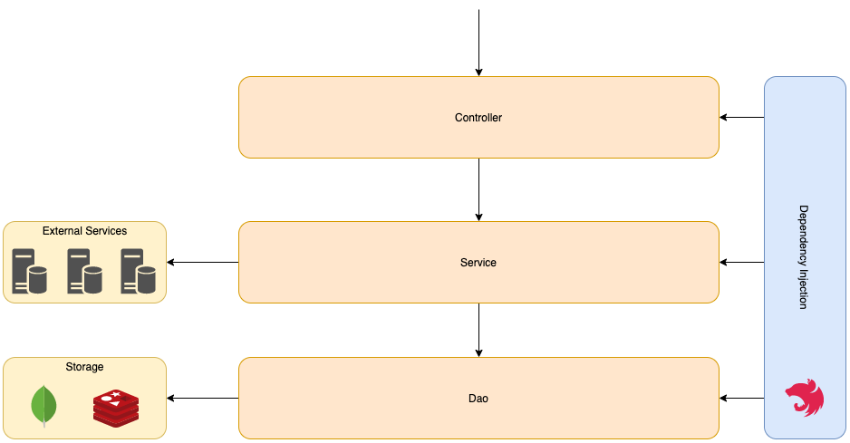

A aplicação se baseia inteiramente na Injeção de Dependência, diversos fatores presentes na aplicação são influenciados por ela. Entende-la e principalmente saber usa-la é de extrema importância.

A aplicação implementa uma arquitetura clássica de três camadas, sendo o controller resposável pela definição das rotas e validações rápidas nos dados de entrada, o service por conter as regras de negócio da aplicação e o dao pela comunicação com os bancos de dados.

O framework central é o [NestJS](https://docs.nestjs.com/). Recomendo fortemente que leiam cada frase da documentação, que é muito boa. O NestJS que é o responsável pela injeção de dependência e pela gerência geral da aplicação. Por debaixo dos panos o Express é utilizado, sendo possível trocar para o Fastify sem esforço nenhum.

### Controller
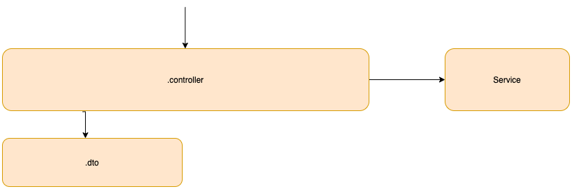

A responsabilidade principal do controller é definir as rotas e realizar validações rápidas nos dados de entrada, sejam eles enviados por body ou query params.

Esses dados de entrada recebidos por body são modelados pelos DTOs, por exemplo:
``` typescript
export class ViabilityDto {
    @IsCepValid()
    cep: string;
    city: string;
}

@Post('/')
consultViability(@Body() body: ViabilityDto): Promise<any> {
    return this.viabilityService.consultViability(body);
}
```

E essas validações rápidas são feitas através de anotações como a `@IsCepValid()`. E são implementados utilizando o biblioteca `class-validator`. Isso com o objetivo de deixar o código o mais declarativo possível, melhorando a manutenabilidade. A forma clássica de fazer isso seria entupir o codigo de `ifs` o que o deixa muito mais difícil de entender. Com esse tipo de abordagem, ao olhar essa classe, por exemplo, você sabe rapidamente que tem uma validação.

A implementação dessa anotação, por exemplo:
``` typescript
export function IsCepValid(validationOptions?: ValidationOptions) {
    return function (object: unknown, propertyName: string) {
        registerDecorator({
            name: "IsCepValid",
            target: object.constructor,
            propertyName: propertyName,
            options: validationOptions,
            validator: {
                validate(value: any) {
                    return typeof value === "string" && isValidCEP(value);
                }
            }
        });
    };
}
```
### Service
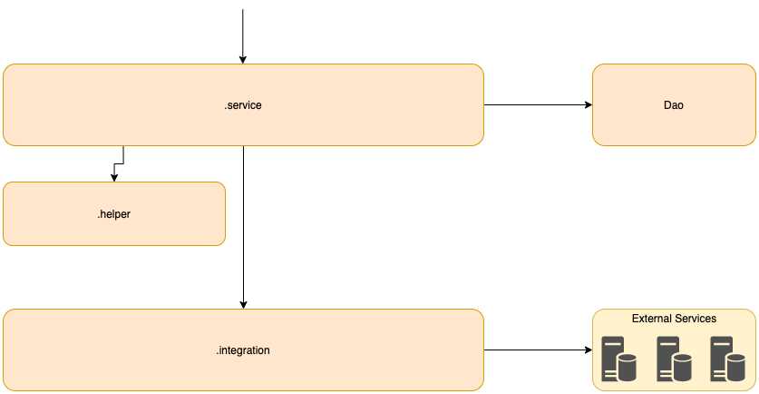

Essa é a camada da aplicação mais complexa e que implementa toda a regra de negócio. Ela faz a integração com as outras camadas, chama os serviços externos e cosulta o banco de dados. Os testes unitários tem que focar nessa camada, que é de fato a mais importante da aplicação.
 
As classes `.integration` são responsáveis por fazer a integração com serviços externos, qualquer chamada feita pela aplicação deve ser implementada aqui. E existem duas classes base, a `BaseIngtegration` que toda classe de integração deve estender, e a `ApiGatewayIntegration` que todos os serviços que passam pelo API Gateway devem estender. Ambas as classes já implementam rotinas comuns aos fluxos, como por exemplo a autenticação no api gateway.

Esse é o parametro para as integrações consumirem os serviços:
``` typescript
export interface APIConsume {
    // Chave do endpoint presente na collection de configuration
    configAddressKey: string;
    // Campo utilizado internamente
    address: string;
    // Body que será enviado na requisição
    body?: any;
    // Query params no formato { key: value }
    query?: any;
    // Headers da requisição
    headers?: any;
    // Parametros de cache, que serão explicados mais a frente
    cache: {
      key: string,
      forceConsult: boolean,
      redis: boolean,
      memory: boolean,
      ttl: number
    },
    // Opções gerais da requisição
    options: {
      timeout: number,
      method: Method,
      responseType: string
    }
}
```

Um exemplo de uso
``` typescript
consultViability(body: ViabilityDto): Promise<APIResponse> {
    const consumeOptions = {
        configAddressKey: VIABILITY_CONSULT,
        body,
        cache: {
            key: `viabilitycache:${body.cep}`,
            redis: true,
            memory: true,
            forceConsult: true,
        },
        options: {
            method: 'POST',
        },
    } as APIConsume;

    return this.consumeAPIGatewayService(consumeOptions);
}
```
### Dao
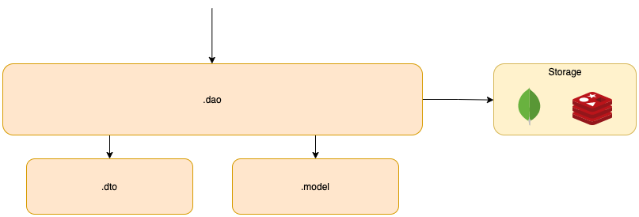

Camada responsável por acessar os bancos de dados. TODA query só deve estar presente aqui. A classe `BaseDao` já implementa boa parte das queries ao mongo, basta extende-la e utilizar os métodos.

E para usar o redis, basta injetar o `RedisDao`. Por exemplo:
``` typescript
@Injectable({ scope: Scope.REQUEST })
export class ConfigurationDao {
    constructor(private readonly redisDao: RedisDao) {}
}
```
## Caching
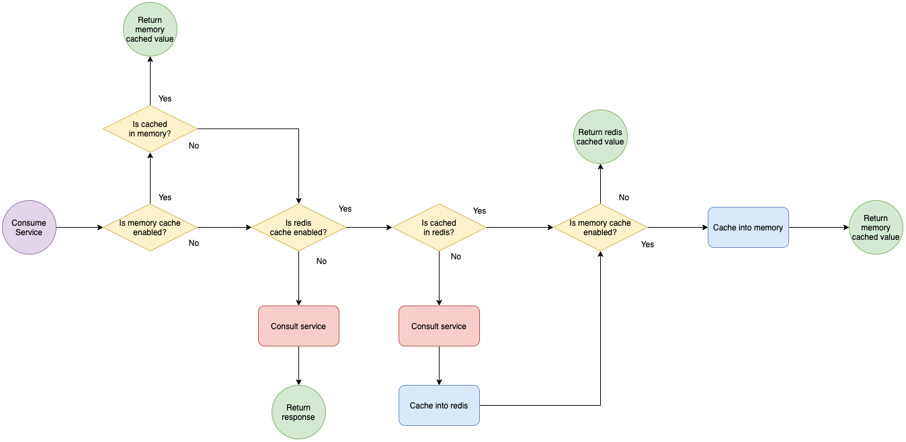
Cache padrão do consume de serviços da aplicação.

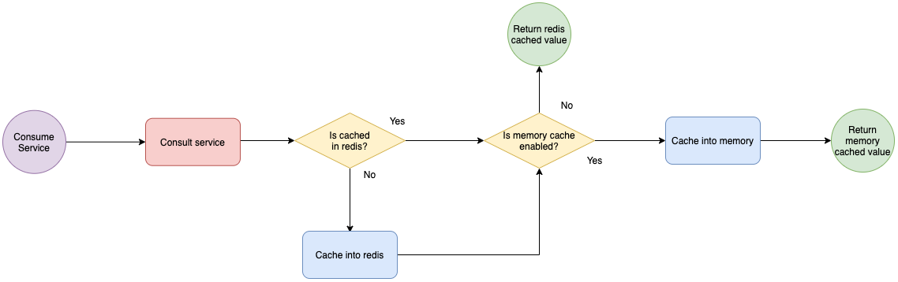
Fluxo do cache com o `forceConsult` ativado.

A estratégia de caching padrão que usamos é o cache com o Redis, onde vamos armazenar os retornos de alguns serviços (e que fizerem sentido) e estados de funcionalidades da aplicação, tudo conforme já é feito em diversos outros projetos. E a funcionalidade é a mesma de sempre: Caso o resultado já esteja no Redis, então ele será usado, caso contrário faremos a consulta no serviço e então guardaremos no Redis.

Porém, existe uma outra camada e forma de caching que permite ainda mais performance e menos gasto de recursos e acessos remotos, além de aumentar a manutenabilidade do código, deixando-o mais desacoplado. Além do caching no Redis, também temos o `Request Instance Caching`, que é uma forma de cache onde retornos de serviços podem ser *cacheados* na memória por toda a vida da requisição e podem ser acessados por Injeção de Dependência em qualquer parte do código, deixando ainda mais desacoplado e evitando o *prop drilling*.

A imagem acima exemplifica o caching realizado pela aplicação, mostrando um fluxograma das decisões do processo de caching.

O consumo de APIs externas, por exemplo, oferece um mecanismo de cache no redis e na memória, sendo o cache na memória com o objetivo, como dito antes, de desacoplar o código e aumentar manutenabilidade.

Foquemos nos atributos de cache
```typescript
cache: {
  key: string,
  forceConsult: boolean,
  redis: boolean,
  memory: boolean,
  ttl: number
}
```

- A `key` é a chave que vai ser usada no cache do redis ou (inclusivo) in-memory. Precisa ser um identificador único do contexto.
- `forceConsult` força uma ida ao serviço, bypassando a etapa inicial de caching. Porém a volta ainda pode ser cacheada.
- `redis` e `memory` indicam se esses níveis de cache devem ser usados ou não.
- `ttl` é o tempo de vida do cache no redis, caso o redis seja usado.

Por exemplo:
``` typescript
const consumeOptions = {
  configAddressKey: VIABILITY_CONSULT,
  body,
  cache: {
      key: `viabilitycache:${body.cep}`,
      redis: true,
      memory: true,
      forceConsult: true,
  },
  options: {
      method: 'POST',
  },
} as APIConsume;

return this.consumeAPIGatewayService(consumeOptions);
```

O cache no redis é vital para a aplicação, pois diminui drásticamente o número de requisições aos serviços, e também suporta o estado de algumas funcionalidades.

Um caso de uso, por exemplo, do cache em memória é quando a resposta de um serviço precisa ser utilizada por diversas partes do código, e ao invés de sair passando o resultado por diversas funções e classes, podemos utilizar o cache pra evitar esse *prop drilling*, e conseguindo injetar esse retorno com Injeção de Dependência.

Por exemplo:
``` typescript
export class ViabilityIntegration extends ApiGatewayIntegration {
    context = ViabilityIntegration.name;

    consultViability(body: ViabilityDto): Promise<APIResponse> {
        const consumeOptions = {
            configAddressKey: VIABILITY_CONSULT,
            body,
            cache: {
                key: `viabilitycache:${body.cep}`,
                redis: true,
                memory: true,
                forceConsult: true,
            },
            options: {
                method: 'POST',
            },
        } as APIConsume;

        return this.consumeAPIGatewayService(consumeOptions);
    }
}
```

Essa função consome um serviço fictício de viabilidade e utiliza todos os níveis de cache. A primeira vez que ela for chamada ela vai de fato chamar o serviço, mas das próximas vezes não, o resultado será guardado em memória e todos os próximos acessos, dentro da mesma requisição, receberão o mesmo resoltado guardado em memória.

Então, essa função pode ser chamada diversas vezes em diferentes partes do código que vai retornar o mesmo resultado cacheado. Tudo isso graças a injeção de dependência, que mantém a instância dessa classe viva por toda a requsição.

A classe `ConfigurationDao`, por exemplo, faz uso extensivo de cache em memória. Tudo isso porque precisamos o tempo inteiro acessar as configurações que estão no mongo e cacheadas no redis, e para evitar isso, o cache em memory é usado. Então, podem chamar as funções dessa classe sem medo, ela não fica indo no mongo e redis o tempo inteiro.

O caching não se limita apenas ao retorno de serviços, também será utilizado para guardar estado de funcionalidades conforme o sistema
for evoluindo.

E lembrando, **o cache em memória só dura o tempo da requisição**. É o mesmo que ficar andando com a variável pelo código passando função por função.

## Collection de configuração
Tendo em vista que a aplicação é extramente parametrizável, a collection de configuração supre essa demanda fornecendo uma forma de configuração sem termos que alterar diretamente o código.

A estrutura dela é a seguinte:
``` json
{
    "name": "IntegrationServices",
    "value": [
        {
            "name": "AUTENTICACAO_API_GATEWAY",
            "address": "http://localhost:3500/apigtwlogin"
        },
        {
            "name": "CONSULTA_VIABILIDADE",
            "address": "http://localhost:3500/viability"
        }
    ]
}
```

Onde o `name` é um identificador único dentro dessa collection, o `value` é sempre um array de objetos que contém alguma configuração. Esse exemplo mostra uma configuração que guarda todos os endpoints de todos os serviços que são consumidos pela aplicação.

Também poderíamos ter:
``` json
{
    "name": "BearerTokens",
    "value": [
        {
            "name": "API_GTW_BEARER_TOKEN",
            "token": "token"
        }
    ]
}
```

Que guarda todos os Bearer Tokens para autenticação de serviços.

A classe `ConfigurationDao` implementa todos os métodos necessários para acesso às configurações. E para usa-la:

``` typescript
@Injectable()
export class MyClass {
    constructor(private readonly configDao ConfigurationDao) {}
}
```

Ela possui basicamente dois métodos:

``` typescript
async getIntegrationServiceConfiguration(name: string)
```

O primeiro busca um endpoint na tabela de configuração, não precisa chama-lo nas classes de integração, a `BaseIntegration` já faz isso, basta passar o `configAddressKey` do `APiConsume` quando for consumir.

Por exemplo:
``` typescript
const consumeOptions = {
  configAddressKey: VIABILITY_CONSULT,
  body,
  cache: {
      key: `viabilitycache:${body.cep}`,
      redis: true,
      memory: true,
      forceConsult: true,
  },
  options: {
      method: 'POST',
  },
} as APIConsume;

return this.consumeAPIGatewayService(consumeOptions);
```

``` typescript
async getDefaultConfiguration(name: string, subValue: string)
```

E esse que é o mais utilizado, e serve pra buscar uma configuration espeçifica. Por exemplo:
``` typescript
[
  {
      "name": "BearerTokens",
      "value": [
          {
              "name": "API_GTW_BEARER_TOKEN",
              "token": "token"
          },
          {
              "name": "API2_GTW_BEARER_TOKEN",
              "token": "token2"
          },
          {
              "name": "API3_GTW_BEARER_TOKEN",
              "token": "token3"
          }
      ]
  },
  {
      "name": "BearerTokens2",
      "value": [
          {
              "name": "API_GTW_BEARER_TOKEN2",
              "token": "token"
          },
          {
              "name": "API2_GTW_BEARER_TOKEN2",
              "token": "token2"
          },
          {
              "name": "API3_GTW_BEARER_TOKEN2",
              "token": "token3"
          }
      ]
  }
]
```

A chamada desta função:
``` typescript
getDefaultConfiguration('BearerTokens', 'API2_GTW_BEARER_TOKEN')
```

Vai retornar o objeto:
``` json
{
    "name": "API2_GTW_BEARER_TOKEN",
    "token": "token2"
}
```

Essa classe usa todos os níveis de cache, tanto de memória quanto no redis. Então, pode chamar sem medo que não vai ficar indo toda hora no redis e muito menos no mongo.

## Collection de audit
A collection de audit serve para auditar interações do app, sejam funcionalidades ou consumo de serviços externos. E especialmente para serviços externos, ela serve como uma prova do que a gente recebeu e o que mandamos para o seviço, facilitando a compreenção do histórico de chamadas.

Ou seja, sempre que consumimos um serviço externo, automaticamente já é gerado um audit de interação, contendo o resultado do serviço. E a classe que é responsável pela inserção de audit é a AuditDao, e ela já implementa alguns métodos comuns a essa funcionalidade, como, por exemplo, adicionar alguns dados da requisição. Não precisa passar nada da requisição pra essa classe, ela já injeta a requisição atual.

Por exemplo:
``` json
{
        "code": "CONSULTA_VIABILIDADE",
        "data": {
            "configAddressKey": "CONSULTA_VIABILIDADE",
            "body": {
                "cep": "24110160",
                "city": "Niterói"
            },
            "cache": {
                "key": "viabilitycache:24110160",
                "redis": true,
                "memory": true,
                "forceConsult": true
            },
            "options": {
                "method": "POST",
                "responseType": "json"
            },
            "headers": {
                "authorization": "Bearer mockedtoken",
                "content-type": "application/json"
            },
            "address": "http://localhost:3500/viability"
        },
        "result": {
            "data": {
                "test": "123"
            },
            "status": NumberInt(200)
        },
        "success": true,
        "requestId": "ckc7xz21w0001xhsp2ejtg1f5",
        "__v": NumberInt(0)
    }
}
```

Todo e qualquer audit possui um `requestId`, que é um identificador único da requisição. Então, é possível ver todos os audits gerados por uma mesma requisição, e também sendo possível ligar com os logs, já que eles também possuem o mesmo `requestId`. E novamente, a própria `AuditDao` coloca o `requestId`, não é necessário passar nada pra ela.

Um exemplo de chamada:
``` typescript
this.auditDao.insertAudit(code, consumeOptions, response, success);
```

## Integração com o API Gateway
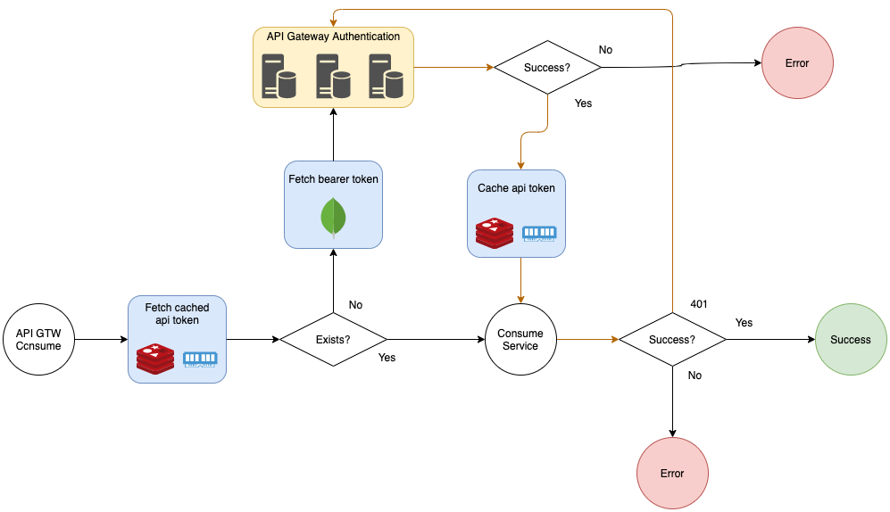

Boa parte das comunicações com os serviços da Oi passam pelo API Gateway, onde ocorre uma autenticação utilizando Bearer Token. Toda essa lógica já está implementada na classe `ApiGatewayIntegration`, basta estende-la.

O funcionamento base possui uma camada de cache do token gerado pela autenticação, que fica no redis e no cache in-memory que **dura apenas o tempo da requisição**. Então se houver múltiplas chamadas a serviços externos durante a mesma requisição, não vai haver várias idas ao redis, já que o token vai ficar armazenado em memória.

O Bearer Token, usado para autenticação com o APi Gateway, fica no Mongo na collection `configuration`.

## Serviços assíncronos
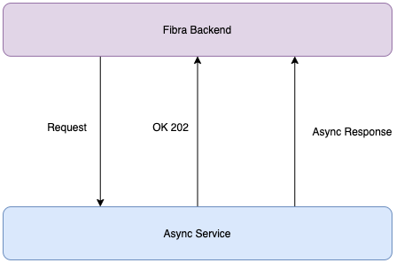
Alguns serviços que o app consome são caracteristicamente assíncronos. Ou seja, o retorno do serviço não vem junto com o retorno imediato da requisição, vem em seguida como uma requisição de *callback*.

A classe `AsyncIntegration` já implementa algumas rotinas em comum desses serviços assíncronos. Então, todo serviço assíncrono deve extender essa classe.

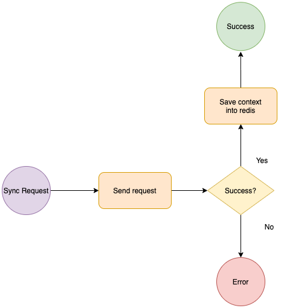
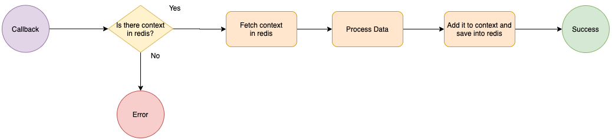
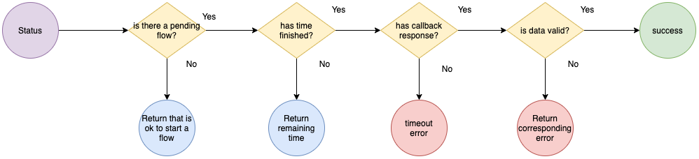

Um exemplo de implementação:

Requisição síncrona:
``` typescript
export class NetQIntegration extends AsyncIntegration {
    consultNetQService(id: string) {
        const consumeOptions = {
            configAddressKey: VIABILITY_CONSULT,
            options: {
                method: 'POST',
            },
        } as APIConsume;

        return this.consumeAsyncAPI(id, consumeOptions, 60000, { a: 123 });
    }
}
```

O id é um identificador único que deve ser gerado para o fluxo. Esse identificador é enviado no body da requisição síncrona e é recebido de volta na requisição assíncrona, e esse id é utilizado como chave pra guardar algumas informações de contexto no redis, pois nem tudo que é necessário para sequencia do fluxo após a chegada do callback é recebida nele. A gente conta com a biblioteca `randomstring` para gerar esses ids para os serviços.

Resposta assíncrona:
``` typescript
@Post('/callback')
async callback(@Body() response): Promise<any> {
    return this.viabilityService.netqCallbackResponse(response);
}
```

A chegada é sempre tratada pelo `controller`. E chama o `service` que vai de fato tratar a resposta e avisar o `integration` que houve a chega do callback.

``` typescript
async netqCallbackResponse(response: any) {
    try {
        // TODO pegar o id da requisição assíncrona
        // TODO parse and handle respose
        await this.netqIntegration.end('testeasync', response);
    } catch (err) {
        if (err instanceof AsyncCallbackError) {
            // TODO audit
            return;
        }

        throw err;
    }
}
```

O primeiro argumento é o id, que no caso é um qualquer só pra fins de teste, mas num exemplo real, o id deveria ser pego do `response`, e caso não exista a resposta do callback deve auditada mas ignorada pelo resto do fluxo.

E o `integration` trata da seguinte forma:

``` typescript
async end(id: string, result: any): Promise<any> {
    const { status } = await this.getContext(id);

    if (status === 'PROCESSING') {
        return this.redisDao.updateObject(id, { callbackResult: result });
    }

    throw new AsyncCallbackError('Callback not expected');
}
```

É por isso que o service tem o `try-catch`, caso o erro seja algum esperado é possível realizar algum tratamento específico. E um callback é não esperada quando não há nenhum objeto de contexto no redis, ou seja, ou chegou algum callback perdido ou ele demorou demais e acabou estourando o timeout do callback.

## Conectividade com o Mongo e Redis
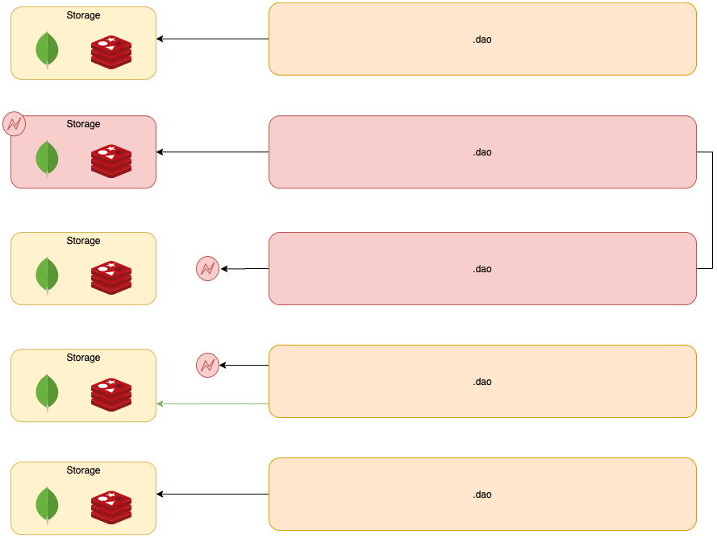

A aplicação é resiliente o suficiente para lidar com quedas temporárias do redis ou mongo. Se houver uma indisponibilidade por um curto pedaço de tempo, a aplicação consegue iniciar uma nova conexão e manter o acesso ao banco funcionando.

## Testes unitários
Os testes unitários da aplicação são feitos utilizando [Jest](https://jestjs.io/pt-BR/) juntamente com o [módulo de teste do NestJS](https://docs.nestjs.com/fundamentals/testing). E necessariamente cada teste unitário **precisa cobrir todos os cenários de uma função**, com base na sua [complexidade ciclomática](https://www.perforce.com/blog/qac/what-cyclomatic-complexity). Ou seja, uma função com 3 de complexidade ciclomática, precisa ter no **mínimo** três testes unitários.

Por exemplo, essa função precisa ter, no mínimo, três testes unitários:
``` typescript
function test(a) {
    if (a == 2) {
        return 5
    }

    if (a == 1) {
        return 3
    }

    return -1;
}
```

Outro ponto importante dos testes unitários é a assertividade de chamada e dos parametros das funções. É uma boa prática sempre verificar o número de vezes que a função foi chamada e com quais parametros, pois permite encontrar defeitos no código após uma refatoração de uma forma muito mais rápida.

Por exemplo:
``` typescript
it('should get cached token when exists', async () => {
    const token = 'token';
    const headers = 'headers';
    const apiResult = 'apiResult';
    const consumeOptions = {} as APIConsume;

    const getToken = jest.spyOn(integration, 'getToken');
    const getHeaders = jest.spyOn(integration, 'getHeaders');
    const consumeJsonAPI = jest.spyOn(integration, 'consumeJsonAPI');

    getToken.mockResolvedValue(token);
    getHeaders.mockResolvedValue(headers);
    consumeJsonAPI.mockResolvedValue(apiResult);

    const result = await integration.consumeAPIGatewayService(consumeOptions);

    expect(getToken).toBeCalledTimes(1);
    expect(getHeaders).toBeCalledTimes(1);
    expect(getHeaders).toBeCalledWith(token);
    expect(consumeJsonAPI).toBeCalledTimes(1);
    expect(consumeJsonAPI).toBeCalledWith({ ...consumeOptions, headers });

    expect(result).toBe(apiResult);
});
```

E por último, a injeção de dependência facilida muito a criação dos mocks, mas pra isso acontecer precisamos de um pouco de código boilerplate em todos os testes unitários.

Todo teste unitário vai ter isso no início:
``` typescript
let integration;
let configurationDao;
let redisDao;

beforeEach(async () => {
    const contextId = ContextIdFactory.create();
    jest
        .spyOn(ContextIdFactory, 'getByRequest')
        .mockImplementation(() => contextId);

    const moduleRef = await createTestingModule({
        providers: [
            AuditDao,
            ConfigurationDao,
            ApiGatewayIntegration
        ]
    });

    integration = await moduleRef.resolve<ApiGatewayIntegration>(ApiGatewayIntegration, contextId);
    configurationDao = await moduleRef.resolve<ConfigurationDao>(ConfigurationDao, contextId);
    redisDao = moduleRef.get<RedisDao>(RedisDao);
});
```

Vamos por partes.

``` typescript
const moduleRef = await createTestingModule({
    providers: [
        AuditDao,
        ConfigurationDao,
        ApiGatewayIntegration
    ]
});
```
Essa parte está criando o contexto de injeção de dependência. Todos os módulos envolvidos no teste, devem estar aqui.

``` typescript
const contextId = ContextIdFactory.create();
jest
    .spyOn(ContextIdFactory, 'getByRequest')
    .mockImplementation(() => contextId);
```
Como nesse teste em específico existem alguns módulos que tem escopo de requisição, é necessário criar um `contextId` falso pro NestJS não gerar uma instância nova a cada vez que o módulo for pedido. E isso está descrito na [documentação do NestJS](https://docs.nestjs.com/fundamentals/testing#testing-request-scoped-instances).

``` typescript
integration = await moduleRef.resolve<ApiGatewayIntegration>(ApiGatewayIntegration, contextId);
configurationDao = await moduleRef.resolve<ConfigurationDao>(ConfigurationDao, contextId);
redisDao = moduleRef.get<RedisDao>(RedisDao);
```
E por fim tem a injeção de fato dos módulos.

## Testes e2e
Esse tipo de teste só é possível de ser feito dentro da aplicação graças a injeção de dependência, e adiciona um comportamenmto fundamental na garantia de qualidade do sistema. E são esses pontos que diferem um sistema de padaria pra um sistema de gente grande.

TODO...

# Backend de Mock

# Logs
A aplicação tem um sistema de logs, utilizando o [Winston](https://www.npmjs.com/package/winston), que é consumido pelo ELK, e serve como dado de proveniência do processo da aplicação. O output do log ocorre dependendo do ambiente, se for local é no console, se for qualquer outro é em arquivo.

Todo log dentro do contexto de uma requisição, que é cerca de 99%, possui um requestId, o mesmo que aparece na collection de audit, sendo assim possível fazer um "join" dos logs no Kibana com os Audits. E para adicionar o requestId não precisa fazer nada, a classe `AppLogger` já se encarrega de injetar o request.

A classe `AppLogger` é acessível globalmente, então não precisa ser declarada como providers em todos os módulos.

O parametro do log pode ser uma string ou um objeto.

Exemplo de uso:
``` typescript
class Example {
    constructor(private readonly appLogger: Applogger) {}

    test() {
        this.appLogger.log({ test: 123 });
        this.appLogger.debug("123");
    }
}
```

Alguns logs padrões que já automaticamente, por exemplo:
- Toda requisição é logada, tanto na chamada quanto na resposta.
- Toda inserção de audit é logada.
- Todo o processo de caching tem log, sendo possível observar o comportamento.
- Toda exceção nao tratada pelo app é logada.
# Links Úteis